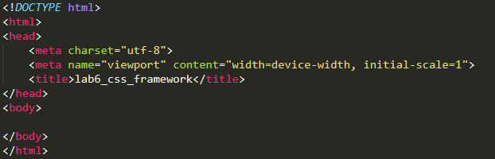

# PRAKTIKUM PEMPROGRAMAN WEB
Nama  : Komarudin 

NIM   : 312010068 

Kelas : TI.20.D.1 

## Praktikum Web Framework Menggunakan Twitter Bostrap

### Langkah - langkah praktikum 

### 1. Buat folder baru dengan nama lab6_css_framework, dan buat dokumen html.

    

