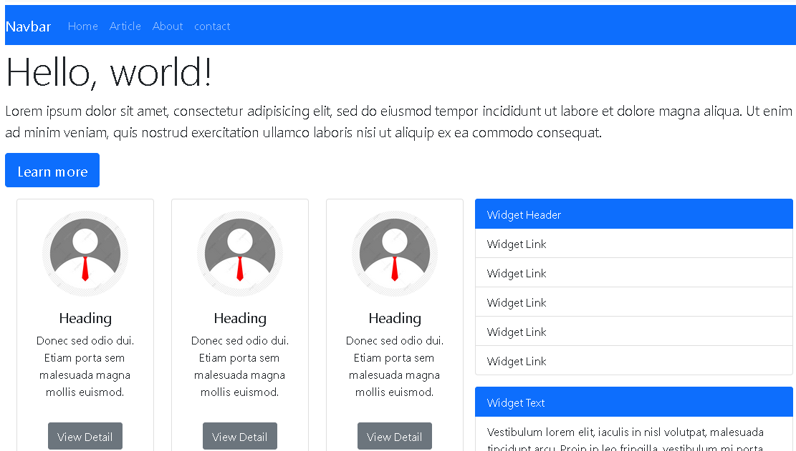

# PRAKTIKUM PEMPROGRAMAN WEB
Nama  : Komarudin 

NIM   : 312010068 

Kelas : TI.20.D.1 

## Praktikum Web Framework Menggunakan Twitter Bostrap

### Langkah - langkah praktikum 

### 1. Buat folder baru dengan nama lab6_css_framework, dan buat dokumen html.

### 2. Buat layout sederhana menggunakan css framework Twitter bootstrap.

Disini saya menggunakan Bootstrap v5.0

Buat menu website berupa komponan navigasi.

Kemudian buka file lab6_css_framework.html di browser.

Buat Jumbotron atau area besar pada bootstrap, digunakan untuk menampilkan sebuah informasi.

Kemudian refresh browser nya.

Membuat body konten menggunakan Cards.

style untuk mengatur ukuran gambar.

Kemudia refresh browser dan lihat hasilnya.

Menambahkan Widget.

